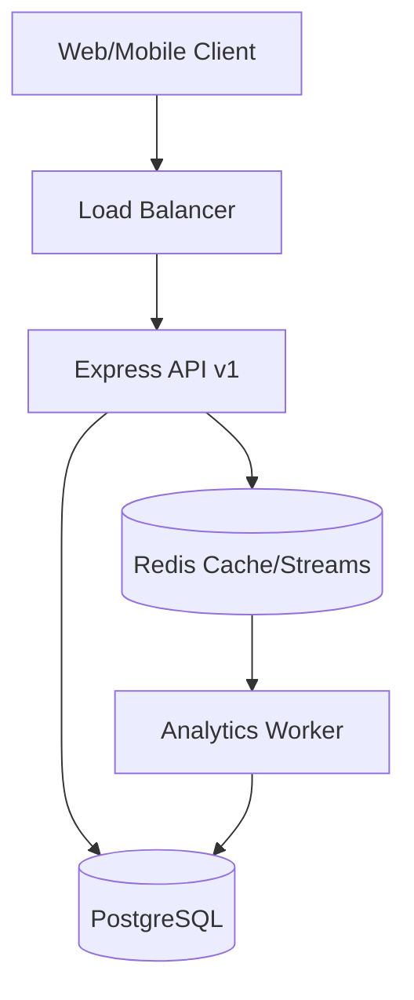

# 📺 Content Broadcasting System

[](https://nodejs.org/)
[](https://www.prisma.io/)
[](https://redis.io/)
[](#architecture)

A high-performance, resilient educational platform designed for deterministic content distribution. Built with a focus on strict concurrency control, system-wide immutability, and real-time analytics.

---

## 🚀 Key Features

- **🎯 Deterministic Rotation Engine**: A pure-function based scheduling algorithm (ADR-002) ensuring synchronized broadcasting across multiple server nodes.
- **🛡️ Enterprise-Grade Security**: JWT-based authentication with role-based access control (Principal vs. Teacher).
- **🔒 Approval Workflow**: Multi-stage content approval system with DB-level immutability triggers (ADR-003).
- **📈 Real-time Analytics**: Distributed view tracking using Redis Streams and a high-throughput background worker (ADR-010).
- **⚡ Performance First**:
  - **SingleFlight**: Prevents cache stampede/thundering herd on DB misses.
  - **Connection Pooling**: Optimized PostgreSQL pooling (max 20) via pg-pool.
  - **Idempotency**: Redis-backed idempotency guards for all mutating operations.
- **📸 Secure Storage**: Decoupled storage provider interface with local/cloud support.

---

## 🏗️ Architecture

The system follows a **3-Layer Service-Oriented Architecture** (ADR-001):

1.  **Controllers**: Request validation (Zod), rate limiting, and HTTP response handling.
2.  **Services**: Domain business logic, transaction management, and integration.
3.  **Data Access (Prisma)**: Strongly-typed database interactions with PostgreSQL.

### System Diagram


---

## 🛠️ Tech Stack

- **Backend**: Node.js, Express, TypeScript 6
- **Database**: PostgreSQL (Prisma 7.8.0)
- **In-Memory**: Redis (ioredis)
- **Validation**: Zod
- **Testing**: Jest, @jest/globals
- **Logging**: Winston (Structured JSON)

---

## 🚦 Getting Started

### Prerequisites
- Node.js v20+
- Docker & Docker Compose

### 1. Infrastructure Setup
Spin up the database and Redis instances:
```bash
docker-compose up -d
```

### 2. Environment Configuration
Create a `.env` file from the template:
```bash
cp .env.example .env
```
*Note: Ensure `DATABASE_URL` points to your local container (default: `localhost:5433`).*

### 3. Installation & Database
```bash
npm install
npx prisma generate
npx prisma migrate dev
```

### 4. Running the System
**Development Mode (Hot Reload):**
```bash
# Start API Server
npm run dev

# Start Analytics Worker (Separate process)
npm run worker
```

**Production Mode:**
```bash
npm run build
npm start
```

---

## 🧪 Testing
The system emphasizes testability with pure functions for core logic.
```bash
# Run unit tests
npx jest
```

---

## 📝 API Versioning & Standards
- All endpoints follow the `/api/v1/` prefix.
- Use `Idempotency-Key` header for safe retries on mutations.
- List endpoints support standard `limit` and `offset` pagination.

---

## 📜 License
ISC License - Copyright (c) 2026
